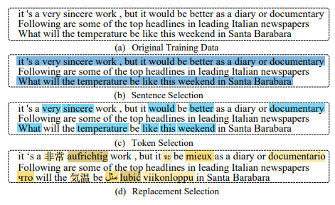
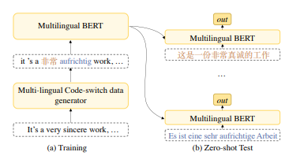

[TOC] 

## 6.28 Update

### [A Knowledge-Enhanced Pretraining Model for Commonsense Story Generation](https://arxiv.org/pdf/2001.05139.pdf)

#### 领域

常识故事生成。假设一个单句故事从上下文开始，模型应该继续用合理的情节完成一个单句故事。

#### 问题

通常做法是选择一系列的事件，以合理的逻辑或情节形成一个故事。但是**输入信息有限**，预训练model如GPT-2仍然**遭受重复，逻辑冲突，以及在生成的故事中缺乏长期的连贯性**。推测原因：有限的输入信息很难将相关的常识联系起来，理解因果关系，以及以适当的时间顺序规划实体和事件。现有的model **Good at** local coherence，但是**Struggle to**: 规划一个连贯的情节，并在整个故事中保持一个合理的事件顺序，也受限制于generic plot

#### 模型

##### Tip

- We  **enhance  GPT-2  with such  knowledge  by  post-training**  the  model  on the  knowledge  examples  constructed  from  these knowledge  bases,  which  can  provide  additional crucial information for story generation.
- we  adopt  multi-task  learning  to  address the problem of **handling causal and temporal dependencies**. 

##### Incorporate knowledge into GPT-2

以前所有工作都假设训练数据和知识库之间存在对齐，造成的结果(1)很难将训练数据中提取出来的事件与KB中存储的事件进行匹配。(2)知识图中多跳三跳的学习和利用，由于规模较大，时间开销较大。(3)大部分知识库三元组没有出现在特定任务的训练数据中，所以那些没有出现的三元组没有被充分利用。

原文隐性的隐入知识(ConceptNet[h r t]\ATOMIC[if-then trip])用于post-train。为了solve上面的problem，将三元组变成句子(通过模板，不直接拼接是因为出现 unknown token或者打破了预训练的句法特征syntactic)。

##### Multi-Task learning

为了improve story的 logic  and  coherence， 设计鉴别器区分fake和true story. Fake story的构建是随机删除，随机替换，打乱顺序--(Top k个句子，但是不包含第一个句子)。

#### 疑问

- 如何multi-Task learning
- 知识如何选择？怎么有效利用三元组？
  origin paper: we  randomly  selected  stories  and  knowledge sentences for training/validation/test respectively.

### [Pre-training Text Encoders as Discriminators Rather Than Generators](https://arxiv.org/pdf/2003.10555.pdf)

#### 领域

改进bert等预训练的MLM任务，通用的text encoder。

#### 挑战

由于学习双向表示法，这些掩码语言建模(MLM)方法比传统的语言模型预训练更有效，但由于每个example，model只学习15%的标记，因此会**产生大量的计算成本**。另外因为pretrain阶段使用了人工[MASK]，导致了pretrain和下游的**mismatch**。

#### 模型

提出一个新的pretrain task -- replaced token detection。区别于MLM，原文model通过使用来自proposal distribution的采样替换一些token来破坏输入，而这些采样token通常是一个小型掩码语言模型的输出，然后将网络预训练成一个鉴别器，可以预测每一个令牌是原始的还是替换的。这样的关键优势是，模型从所有的输入token中学习，而不仅仅是小的mask-out集，这使得它的计算效率更高。与现有的生成语言表示学习方法相比，**原文的重要claim区分真实数据和具有挑战性的负样本的表征任务具有更高的计算效率和参数效率**。同量级model比较上更快而且下游任务的表现上更好，改进的小model单卡4天可以训练完(与同量级bert比效果更好)。

Model包含generator以及discriminator，generator是一个小型的MLM model。流程是对输入随机mask（15%或者25%），然后使用MLM将其预测出来(利用最大似然函数，仅仅对mask的词处理，原来公式有问题)，可能预测对也可能预测错，这样就得到了corrupted inputs，最后送到鉴别器discriminator里二分类(origin or replace)。

## 7.5 Update

### [CoSDA-ML: Multi-Lingual Code-Switching Data Augmentation for Zero-Shot Cross-Lingual NLP](https://arxiv.org/abs/2006.06402)

#### 领域

Multi-lingual contextualized embeddings.

#### 挑战

**跨语言模型受到不同语言之间子词不一致的上下文化表示的限制**。以前的做法是在不同的语言中提取一组通用的子词作为训练上下文化嵌入的基础。主要是在训练中来自多种语言的原始句子被合并到一个训练集中，这样共享的子词嵌入和其他参数就可以跨不同的语言进行调优，代表模型就是mBERT。原文认为虽然上述方法通过共享子词和参数实现了zero-shot跨语言适应，但它有明显的局限性--**训练跨语言嵌入的上下文仍然是单语言**的，这可能导致**不同语言之间子词的上下文化表示不一致**。目前的一些改进有两种：(1)通过使用词对齐信息，从嵌入到目标对应物的源上下文化子词中学习映射函数；(2)另一种使用code mixing来构造由源和目标短语组成的训练句子，以便对mBERT进行微调。但是目前这两种方法一次只考虑一对源语言和目标语言，因此导致**每种目标语言都有单独的模型(不是大一统模型)**。

#### 模型

构建Multi-Lingual Code-Switching Data Augmentation用来fine tune mbert，然后再zero-shot test下游任务。Multi-Lingual Code-Switching Data Augmentation的方法是

先随机选句子，然后在选择的句子中随机选词，最后根据bilingual-dictionary替换为其他语言。训练为：

## 7.19 Update

### [BAM! Born-Again Multi-Task Networks for Natural LanguageUnderstanding](https://www.aclweb.org/anthology/P19-1595.pdf) 

#### 领域

Multi-task NLU

#### 挑战

多任务一般都不如单任务优秀。原文使用知识提取(knowledge distillation)，其中单任务模型教多任务模型。具体原文采用teacher annealing的新方法来加强这种训练，使多任务模型从蒸馏逐步过渡到监督学习，使**多任务模型优于单任务teacher**。

直观上，蒸馏是有效的，因为教师的输出分布在整个class比一个单一的one-hot label提供更多的训练信号。原文提出 Teacher  annealing 好处是逐渐使学生从向教师学习过渡到向golden label学习。这种方法保证了学生在训练初期就得到丰富的训练信号，而不局限于仅仅模仿老师。

#### 模型

一系列任务，使用一个task作为teacher然后训练multi-task student:

$$\mathcal{L}(\theta)=\sum_{\tau \in \mathcal{T}} \sum_{x_{\tau}^{i}, y_{\tau}^{i} \in \mathcal{D}_{\tau}} \ell\left(f_{\tau}\left(x_{\tau}^{i}, \theta_{\tau}\right), f_{\tau}\left(x_{\tau}^{i}, \theta\right)\right)$$ .

Teacher  annealing：在训练中将教师预测与golden标签混合:$$\ell\left(\lambda y_{\tau}^{i}+(1-\lambda) f_{\tau}\left(x_{\tau}^{i}, \theta_{\tau}\right), f_{\tau}\left(x_{\tau}^{i}, \theta\right)\right)$$ ,其中$$\lambda$$是从0到1的增长

使用了分层学习率，按概率采样喂入数据，

#### 问题

- the teacher and student have the same neural architecture and model size？

  蒸馏的student不应该是更简单的model嘛。

- Intuitively, knowledge distillation improves training because the full  distribution over labels provided by the teacher provides a richer training  signal than a one-hot label.

  形式上是一个l2距离损失函数，为什么可以认为教师的输出分布在整个class比一个单一的one-hot label提供更多的训练信号？

- Ground questions

  - multi-task是怎么训练的？

  - 数据是怎么喂入的？

    sampling procedure：the probability of training on an example for a particular taskτis proportional

  - 一个task teacher教multi-task的输入输出流是什么？这些task大类上都是相同的吗？

### [Context-Aware Cross-Lingual Mapping](https://arxiv.org/pdf/1903.03243.pdf)

#### 领域

cross lingual word vector mapping

#### 挑战

提出了一种**替代词级映射的方法**，更好地反映了句子级跨语言的相似性。在平行语料库中，通过直接映射对齐句子的平均嵌入，将上下文合并到转换矩阵中，同时通过词语对齐的平行句实现深度上下文化词语嵌入的跨语言映射。结果表明，**使用合理大小的并行语料库，上下文感知映射明显优于上下文独立的跨语言单词映射，特别是在使用上下文化的单词嵌入时**。

#### 模型

- Orthogonal Bilingual Mapping

  $$R=\underset{\hat{R}}{\arg \min }\|\hat{R} X-Y\| \quad \text { s. t. } \hat{R}^{T} \hat{R}=I$$ 

-  Sentence-Level Mapping

  一个句子比单独的单词的模糊感要小，因为单词是在一个特定的上下文中解释的，所以在句子层次上学习的map很可能对单个单词的不一致不敏感。使用Orthogonal Bilingual Mapping。

#### 问题

- 怎么训练？

  

